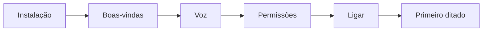
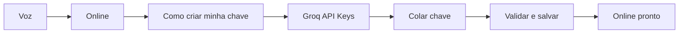
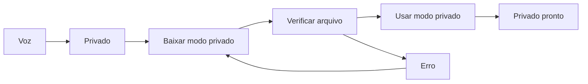
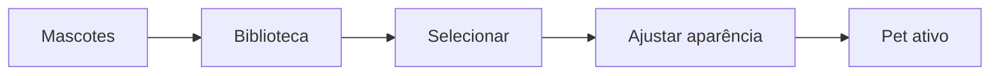
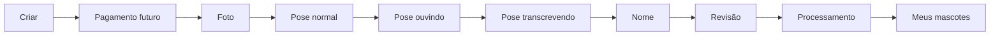

# GRU — Plano de Reestruturação do Frontend

> Parte 1/3 — arquitetura da experiência. Este documento define a futura organização do produto, não altera telas, contratos, backend, overlay nem o design visual vigente.

## 1. Objetivo

Transformar o Gru de uma tela de configurações com abas superiores em uma experiência Android simples, guiada e operacional. A pessoa deve conseguir, nesta ordem: entender o que falta, escolher como quer ditar, ligar o Gru e só depois descobrir ou criar mascotes.

O produto continuará tendo o mesmo runtime: pet flutuante, Acessibilidade, microfone, Groq Online, Whisper Privado e mascotes locais. A mudança é de arquitetura de informação e de linguagem, não de capacidade técnica nesta fase.

## 2. Problemas da interface atual

- `Geral` concentra status e permissões com nomes que não deixam clara a próxima ação.
- `Transcrição` é tecnicamente correto, mas não comunica de imediato a escolha humana: rapidez online versus privacidade no aparelho.
- A ação principal — ligar ou desligar o pet flutuante — não tem posição protagonista.
- `Mascote` reúne biblioteca, configuração, criação e acompanhamento em uma única tela extensa.
- A criação de mascote já possui muitos estados reais, mas não é apresentada como uma jornada curta de uma decisão por vez.
- Acessibilidade abre a Configuração do Android, porém o caminho posterior precisa ser ensinado com o nome real do serviço: **Pet flutuante do Gru**.
- O estado operacional depende de pré-requisitos distribuídos; o usuário não deve precisar deduzir qual deles está faltando.

## 3. Princípios da nova experiência

1. **Operar antes de configurar.** A primeira pergunta é “o Gru está pronto para eu ditar?”, não “qual painel devo abrir?”.
2. **Por quê antes de como.** Cada permissão e modo explica seu benefício antes de pedir uma ação.
3. **Uma decisão por tela crítica.** Principalmente em criação, pagamento e tutorial da chave Groq.
4. **Estado explícito.** Ícone, texto e cor semântica trabalham juntos; cor nunca é o único sinal.
5. **Segurança preservada.** Não há fallback silencioso para Groq, não há chamada de rede no overlay e não há troca para pacote de mascote parcial.
6. **Material 3 viável.** A Parte 2 deve usar padrões que possam ser traduzidos para Jetpack Compose e respeitar Dynamic Color, tema escuro, fonte 200%, RTL e alvos de 48dp.
7. **Criação é um serviço.** Biblioteca e criação permanecem separadas, inclusive porque pagamento é uma futura dependência de produto.

## 4. Arquitetura de navegação

Após o onboarding, a raiz do aplicativo passa a usar uma Navigation Bar inferior com cinco destinos:

| Ordem | Destino | Papel |
| ---: | --- | --- |
| 1 | Permissões | Deixar o Gru pronto para funcionar. |
| 2 | Voz | Escolher e preparar o modo de transcrição. |
| 3 | Ligar/Desligar | Controle operacional principal. |
| 4 | Mascotes | Biblioteca, seleção, aparência e arquivados. |
| 5 | Criar | Jornada separada para adquirir/criar um mascote. |

### Botão central

**Recomendação: opção B.** O item central abre uma tela de controle com um botão grande de ligar/desligar; o toque na Navigation Bar não alterna o estado diretamente.

Motivos: reduz desligamento acidental, dá espaço para explicar bloqueios, oferece feedback acessível e acomoda o estado real de pronto/indisponível. O item central pode ter aparência maior e status resumido, mas continua com rótulo TalkBack e área de toque Material válida. Na Parte 2, ele deve ser composto como uma Navigation Bar de quatro destinos mais uma ação central elevada; não assumir que o componente padrão de cinco itens resolverá sozinho essa hierarquia.

### Navegação durante fluxos focados

| Contexto | Navigation Bar | Estrutura futura |
| --- | --- | --- |
| Permissões, Voz, Controle e Mascotes | Persistente | Destinos-raiz. |
| Tutorial da Groq | Temporariamente coberta | Modal bottom sheet ou rota focada, com voltar explícito. |
| Edição de nome / arquivamento | Temporariamente coberta | Diálogo Material. |
| Criação de mascote após iniciar o fluxo | Oculta | Rota de passo a passo com topo, progresso e voltar/cancelar. |
| Pagamento futuro | Oculta | Rota isolada, com retorno verificável para a revisão. |

## 5. Permissões

### Objetivo

Permitir que alguém sem vocabulário técnico deixe o Gru pronto, entendendo o motivo de cada permissão e a próxima ação exata.

### Estrutura proposta

- Título: **Deixe o Gru pronto**.
- Resumo: `x de y etapas concluídas`, com texto equivalente para TalkBack.
- Checklist ordenado: Acessibilidade, Microfone, Notificações (somente quando aplicável) e estado operacional do pet.
- Cada item mostra ícone, nome simples, descrição curta, status textual e uma única ação.

| Item | Linguagem para a pessoa | Ação e comportamento |
| --- | --- | --- |
| Acessibilidade | “O Gru usa esta permissão para colocar o que você falou no campo onde está escrevendo e mostrar o mascote quando o teclado aparece.” | `Ativar Acessibilidade` abre a configuração do Android e mostra guia: 1) Aplicativos instalados; 2) **Pet flutuante do Gru**; 3) Usar serviço; 4) voltar ao Gru. |
| Microfone | “Permite que o Gru escute sua fala enquanto você dita.” | `Permitir microfone` abre o diálogo nativo. Em recusa, explica como tentar novamente sem culpar o usuário. |
| Notificações | “Ajuda o Gru a continuar funcionando corretamente enquanto o mascote está ativo.” | Visível apenas no Android aplicável; chama permissão nativa. |
| Pronto para usar | “Gru pronto” ou “Precisamos corrigir uma configuração”. | Quando houver falha de overlay, oferece `Resolver agora`/`Tentar novamente`, nunca termos como service bound. |

### Regras

- A tela não deve esconder a etapa concluída; ela serve de comprovante e recuperação.
- Abrir Configurações não equivale a concluir Acessibilidade. Ao voltar ao app, reavaliar o estado real.
- O texto final deve manter a declaração de privacidade existente: o serviço não armazena o que a pessoa digita.

## 6. Voz

### Objetivo

Permitir escolher **como** a fala vira texto, sem exigir que a pessoa conheça API, Whisper ou processamento local.

### Estrutura proposta

1. Cabeçalho: `Como o Gru transforma sua voz em texto`.
2. Seletor expressivo entre **Online** e **Privado** com texto, ícone e estado selecionado. A Parte 2 pode animar a troca, mas a seleção nunca dependerá apenas do movimento.
3. Área de conteúdo do modo selecionado, com uma ação principal por estado.
4. Estado atual persistente e uma explicação de troca segura.

### Online — Groq

Explica: o áudio é enviado à Groq para ser transformado em texto e devolvido ao Gru. Benefícios: rápido, leve para o celular e normalmente adequado a aparelhos intermediários. Limites: requer internet, o áudio sai do aparelho, exige chave e depende de regras/limites vigentes da Groq.

Estados de interface: chave ausente, tutorial aberto, chave sendo salva/validada, pronto, erro de chave e modo ativo.

O conteúdo inclui:

- status `Chave configurada` ou `Configure sua chave`;
- ações `Como criar minha chave`, `Colar chave`, `Alterar chave` e `Remover chave` conforme o estado;
- aviso simples de privacidade;
- nenhuma promessa de franquia gratuita fixa sem validação atualizada antes da redação final.

#### Tutorial “Como criar minha chave”

É uma superfície de conteúdo, preparada para receber vídeo do produto:

1. título e explicação curta;
2. área de vídeo com poster/estado sem vídeo até o ativo existir;
3. passos escritos: criar conta, abrir painel, API Keys, criar, copiar, voltar ao Gru, colar e salvar;
4. `Abrir site da Groq`;
5. `Colar chave` como continuação; 
6. voltar sem perder a tela Voz.

### Privado — no aparelho

Explica: o Gru baixa o Whisper e, depois disso, transforma a fala no próprio celular. Benefícios: áudio não sai do aparelho, funciona sem internet depois da instalação e não usa chave. Custos: armazenamento, bateria, processamento e possível lentidão em aparelhos mais fracos.

| Estado real | Mensagem humana | Ação principal |
| --- | --- | --- |
| Não instalado | “O modo privado ainda não está instalado.” | Baixar modo privado. |
| Preparando | “Preparando o download.” | Aguardar/cancelar quando suportado. |
| Baixando | Progresso por bytes reais. | Cancelar download. |
| Verificando | “Conferindo o arquivo baixado.” | Aguardar. |
| Instalado | “Pronto para usar.” | Usar modo privado. |
| Ativo | “Modo privado em uso.” | Nenhuma ação de ativação. |
| Erro | Explicação curta e recuperável. | Tentar novamente ou trocar para Online. |

### Regra de troca

Ao escolher Privado, nenhuma sessão pode continuar usando Groq enquanto o modo privado está sendo preparado. Se Privado falhar, `Tentar novamente` e `Trocar para Online` são escolhas explícitas. Esta regra já existe no runtime e é inegociável na futura implementação visual.

## 7. Ligar/Desligar

### Objetivo

Ser a casa da ação principal: ativar ou desativar o pet flutuante, sem misturar configuração adicional.

### Estrutura proposta

- Estado dominante: `Gru ligado`, `Gru desligado`, `Não é possível ligar` ou `Precisamos corrigir uma configuração`.
- Ícone e texto de estado acessível, além da cor semântica. A Parte 2 explora verde para ligado e um estado de atenção/desligado para o inverso, sem usar apenas cor.
- Um único botão grande: `Ligar` ou `Desligar`.
- Quando bloqueado, listar apenas o primeiro bloqueio acionável e oferecer `Resolver agora`, que abre Permissões ou Voz conforme a causa.

| Pré-requisito ausente | Mensagem | Destino da recuperação |
| --- | --- | --- |
| Acessibilidade | “Falta permitir que o Gru escreva no campo selecionado.” | Permissões. |
| Microfone | “Falta permitir o microfone.” | Permissões. |
| Motor não preparado | “Escolha como o Gru vai transformar sua voz em texto.” | Voz. |
| Serviço/overlay com falha | “O Gru precisa reconectar o mascote.” | Ação local de recuperação; depois Permissões se persistir. |

Desligar deve ser imediato e reversível. Ligar deve refletir o estado real do runtime — não apenas mudar um rótulo antes de verificar pré-requisitos.

## 8. Mascotes

### Objetivo

Concentrar a biblioteca e a personalização de mascotes já existentes. Esta área não inicia criação.

### Estrutura proposta

1. **Meu mascote atual:** preview maior, nome, origem (`Mascote do Gru` ou `Meu mascote`) e selecionado.
2. **Meus mascotes:** galeria de personalizados ativos, com preview, nome, seleção e editar.
3. **Mascotes do Gru:** biblioteca oficial, visualmente separada da pessoal; itens oficiais não têm edição.
4. **Aparência:** Pequeno, Médio, Grande e avaliação futura da permanência da opacidade.
5. **Poses:** Normal, Ouvindo e Transcrevendo, renderizadas a partir do pacote real disponível.
6. **Arquivados:** área secundária, inicialmente uma proposta de experiência, não capacidade já implementada.

### Edição e arquivamento

O diálogo de um mascote pessoal deverá oferecer `Alterar nome`, `Arquivar`, `Cancelar` e `Salvar` quando houver mudança de nome. A interface só mostra `Arquivar` depois que a persistência suportar essa semântica.

Comportamento pretendido para arquivados:

- não aparecem na galeria principal;
- permanecem recuperáveis em `Arquivados`;
- podem ser restaurados para a biblioteca;
- não podem permanecer ativos se forem arquivados; a UI pede para selecionar outro antes ou faz fallback seguro.

### Viabilidade atual

`CustomMascotStore` já suporta renomear e remover, mas não tem estado de arquivamento nem lista separada. Portanto, arquivar/restaurar exige novo modelo de persistência local; não é uma funcionalidade que a Parte 2 possa prometer como pronta sem trabalho de Parte 3.

## 9. Criar mascote

### Objetivo

Criar uma jornada sequencial de uma decisão por tela, separada da biblioteca e preparada para um serviço pago no futuro.

### Nome da área

Na Navigation Bar, usar **Criar** para caber com clareza. No título de tela, usar **Criar mascote**. A Parte 2 valida essa escolha em fonte ampliada e TalkBack.

### Fluxo planejado

| Etapa | Decisão única | Conteúdo e ação |
| ---: | --- | --- |
| 0. Pagamento | Desbloquear criação | `Criar mascote — R$ 5,00`, resumo do que será entregue e PIX futuro. Sem integração nesta fase. |
| 1. Foto | Escolher a referência | Photo Picker, instruções simples, trocar e continuar. |
| 2. Pose normal | Como aparece parado | Lista dinâmica de opções reais disponíveis. |
| 3. Pose ouvindo | Como aparece gravando | Lista dinâmica de opções reais disponíveis. |
| 4. Pose transcrevendo | Como aparece processando | Lista dinâmica de opções reais disponíveis. |
| 5. Nome | Dar identidade ao mascote | Campo obrigatório com regras reais já existentes. |
| 6. Revisão | Conferir escolhas | Foto, nome, três poses e `Criar meu mascote`. |
| 7. Processamento | Acompanhar sem linguagem técnica | Enviando foto, criando opções, preparando poses, baixando para o celular. |
| 8. Conclusão | Usar ou explorar | `Usar agora` e `Ver em Meus Mascotes`. |

### Regra de compatibilidade com o pipeline atual

Hoje o backend gera opções de Master, a pessoa aprova uma e as poses dependem de templates/pipeline. O futuro fluxo de três poses só pode ser liberado quando o servidor puder receber ou associar escolhas de pose reais de forma segura. Até lá, o design deve prever estados como “as poses serão preparadas depois” e a Parte 3 não pode inventar payloads.

### Pagamento

R$ 5,00 é uma intenção de produto, não uma capacidade existente. A futura implementação requer:

- provedor de PIX e requisitos legais/fiscais;
- identificação de pedido e confirmação server-side;
- vínculo entre pagamento aprovado e direito a uma criação;
- recuperação para pagamento pendente, expirado, estornado e criação não iniciada;
- proteção para que o APK nunca seja a autoridade de “pagamento concluído”.

## 10. Primeiro uso

Meta: instalar, configurar o mínimo e ditar a primeira frase sem conhecer as cinco áreas.

Sequência recomendada:

1. Boas-vindas curta: “Vamos deixar o Gru pronto para ditar.”
2. Voz: escolha Online ou Privado; preparar somente o selecionado.
3. Permissões: Acessibilidade e Microfone; Notificações quando aplicável.
4. Controle: confirmar `Gru pronto` e tocar em `Ligar`.
5. Primeira dica contextual: abrir um campo de texto, mostrar o teclado e tocar no pet.
6. Conclusão: mascotes e criação ficam disponíveis para descoberta posterior, sem bloquearem o primeiro ditado.

## 11. Estados e recuperação

### Estado global de prontidão

O novo frontend deve derivar um estado único de prontidão, sem alterar o runtime:

- `Pronto`: motor, Acessibilidade, microfone e serviço utilizáveis.
- `Em configuração`: existe uma próxima ação clara.
- `Indisponível`: falha operacional recuperável.
- `Desligado`: pré-requisitos estão prontos, mas o pet foi desativado voluntariamente.

### Criação de mascote

Mapear os estados atuais para mensagens humanas, preservando job pendente, idempotência e cancelamento:

| Estado atual | Mensagem futura |
| --- | --- |
| `PhotoSelected` | “Confira sua foto.” |
| `Submitting` | “Enviando foto.” |
| `GenerationPaused` | “Sua criação está salva e aguarda continuação.” |
| `Tracking` | “Criando opções do seu mascote.” |
| `AwaitingMasterApproval` | “Escolha o seu favorito.” |
| `PosePreparationPending` | “Preparando as poses do seu mascote.” |
| `InstallingMascot` | “Baixando para o seu celular.” |
| `Completed` | “Seu mascote está pronto.” |
| `NetworkUnavailable` | “Sem conexão. Vamos continuar quando ela voltar.” |
| `InstallFailed` | “Não conseguimos baixar tudo. Seu mascote atual continua seguro.” |

Falha de rede nunca equivale a falha remota. Repetir instalação não cria novo job. Cancelar só limpa o estado local depois da confirmação remota.

## 12. Acessibilidade

- 48dp como mínimo para qualquer ação, incluindo o item central e a caneta de edição.
- TalkBack anuncia destino, seleção, progresso, estado do Gru e requisito ausente.
- Fonte 200% não esconde título, descrição, botão ou rótulo da Navigation Bar.
- Claro, escuro e Dynamic Color permanecem suportados.
- RTL deve preservar ordem lógica e não espelhar indevidamente estados/ícones.
- Contraste, texto e ícone acompanham cores de ligado, erro e concluído.
- Movimento reduzido transforma transições em corte/fade curto sem remover informação.
- Feedback háptico é opcional e só acompanha transições significativas, nunca é a única confirmação.

## 13. Movimento

Movimento futuro deve explicar mudança de estado:

- seletor Online/Privado: transição curta entre escolhas;
- botão central: mudança de estado confirmada, sem bounce decorativo;
- criação: avanço de etapa como página de livro, com progresso textual;
- cards: confirmação discreta de seleção;
- download/processamento: indicador que não inventa progresso.

Evitar animação contínua no conteúdo de configuração, efeitos de web não nativos e qualquer movimento que dificulte leitura.

## 14. Relação com o backend existente

O plano preserva o contrato atual de mascote:

- Firebase Anonymous Auth e Firebase App Check protegem chamadas;
- criação e aprovação usam idempotência;
- o job é assíncrono, pode ser retomado e é de propriedade do UID;
- Masters e resultados são baixados por endpoints autenticados;
- pacotes locais são validados por SHA-256 e promovidos atomicamente;
- o overlay resolve arquivo local e não chama Modal em runtime;
- os estados `IDLE`, `RECORDING` e `TRANSCRIBING` continuam sendo a fonte dos três visuais.

Nenhuma etapa visual deve mudar endpoints, payloads, quotas, autenticação, Modal, Firebase ou regras de geração.

## 15. Requisitos novos ainda sem suporte

| Requisito | Situação atual | Trabalho futuro necessário |
| --- | --- | --- |
| Arquivar/restaurar mascote | Não existe; há apenas remover. | Campo de estado no manifest/store, filtros e restauração segura. |
| Pagamento PIX por criação | Não existe. | Backend de cobrança, provedor, confirmação server-side e regras legais. |
| Escolha prévia de três poses | Não há contrato para isso. | Catálogo/versionamento de poses e extensão compatível do backend. |
| Tutorial Groq com vídeo | Não há ativo ou superfície própria. | Vídeo aprovado, estratégia de hospedagem/offline e textos revisados. |
| Catálogo oficial novo de mascotes | Built-ins atuais são Lume, Faísca, Bip, Pingo e Pudim. | Ativos aprovados, metadados e migração visual. |
| Progresso de criação por etapa | Backend expõe estados, não progresso granular garantido. | Definir métricas/contrato antes de exibir porcentagem. |

## 16. Mapa de telas

```text
Onboarding
  ├─ Voz inicial
  ├─ Permissões guiadas
  └─ Controle: Ligar

Raiz (Navigation Bar)
  ├─ Permissões
  ├─ Voz
  ├─ Ligar/Desligar
  ├─ Mascotes
  │   ├─ Editar nome
  │   ├─ Arquivar / Arquivados (futuro)
  │   └─ Poses
  └─ Criar
      ├─ Pagamento (futuro)
      ├─ Foto
      ├─ Poses
      ├─ Nome
      ├─ Revisão
      ├─ Processamento
      └─ Conclusão
```

## 17. Fluxos principais

### Primeiro uso



### Online



### Privado



### Mascote existente



### Criar mascote



## 18. Critérios de sucesso

- Uma pessoa nova consegue chegar ao primeiro ditado sem precisar saber o que é Acessibilidade, API ou Whisper.
- Cada destino responde a uma pergunta: “o que falta?”, “como a voz funciona?”, “o Gru está ligado?”, “qual mascote uso?” e “como crio um?”.
- O botão central nunca muda o runtime por acidente e sempre explica bloqueios.
- O fluxo Privado continua sem usar Groq até uma escolha explícita.
- Biblioteca e criação não competem pela mesma tela.
- Estados de job, download e erro mantêm dados seguros e oferecem recuperação coerente.
- O desenho escolhido na Parte 2 é implementável em Material 3/Compose e passa pelos requisitos de acessibilidade.

## 19. Questões ainda abertas

1. O preço R$ 5,00 será fixo, promocional ou configurável por catálogo? Quem será o provedor PIX e qual entidade legal recebe o pagamento?
2. O pagamento libera uma tentativa, um conjunto de três Masters ou também novas gerações/retries?
3. As três poses serão escolhidas antes da geração por catálogo de templates, ou depois de uma biblioteca já gerada? O backend precisa de qual contrato?
4. A opacidade continua sendo uma configuração de produto ou será removida na Parte 2?
5. Qual o destino de um mascote arquivado que está ativo: exigir escolha prévia ou aplicar fallback automático com confirmação?
6. Qual vídeo/tutorial oficial da Groq será aprovado, onde ficará hospedado e como funcionará sem conexão?
7. A barra inferior terá rótulos completos em telas compactas ou o item central usará rótulo abaixo/dentro do botão? A Parte 2 deve validar fonte 200% antes da decisão final.

## 20. Escopo da Parte 2 — Design

A Parte 2 poderá usar **Gru Visual Lab** no Stitch, o arquivo **Gru — Material 3 Visual Lab** no Figma, Material 3 Design Kit e referências conceituais do 21st.dev. Não deve criar projeto/arquivo duplicado nem tratar HTML/React/CSS dessas ferramentas como implementação Android.

Entregáveis esperados da Parte 2:

- propostas visuais para a Navigation Bar e botão central;
- fluxos de primeiro uso, Voz, Permissões, Mascotes e Criar;
- estados vazio, carregando, erro, bloqueio, concluído e fonte 200%;
- componentes e tokens Material 3 reutilizáveis;
- especificação de movimento, acessibilidade e conteúdo;
- decisão explícita sobre os requisitos novos que dependem de backend/pagamento.

Anti-escopo da Parte 2: alterar runtime, inventar endpoints de pose/pagamento, publicar backend, alterar overlay ou apresentar explorações não aprovadas como design final.
